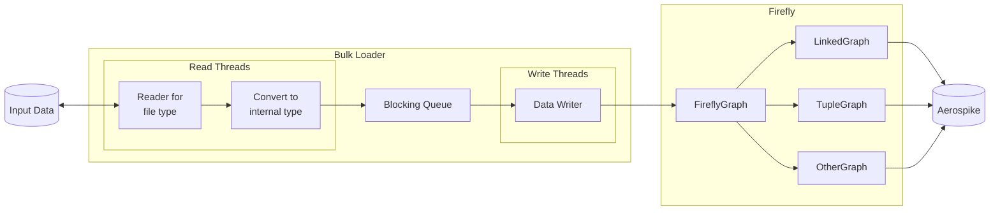

# Bulk Loader Design

## Introduction

The TinkerPop framework has no bulk loader in it. Instead you must use `g.addV()`/`g.addE()` steps
to add data to the graph.

These methods are not efficient for adding a lot of data. This is because they end up broken into single vertex and 
edge writes, that have a lot of overhead.

A bulk loader is designed to circumvent this issue. Additionally, we don't want to make our customers manually
parse files and try to convert that parsing to `addV()` and `addE()` calls. This is a huge hassle and also
is very easy to screw up. Instead, we'd like our customers to export their data to a common file format, such as
`csv` and have us take it from there.

## Potential Issues

Some challenges to consider before we get into the design:
- Vertex id type might not be valid for firefly
- You need to know the vertex id’s to write the edges
  - What if we don't have valid id types to insert, how do we know the id's to insert? 

## Potential Solutions

- Can pack original id as a property if type doesn't match
- Can be recording id's in a separate file and then bulk loading the edges with them
- Can auto generate id's in a way that can be reverse engineered, so we can get the id of any vertex any time

## Bulk Loader to Firefly Loading Interface Options

- We can go through TinkerPop, this is slow, but very generic
  - Can thread this to make it faster.
- Go directly through Aerospike driver, this is very fast, but not generic
  - Would require us to rewrite the bulk loader for each data model
  - Would require us to update the bulk loader for any adjustments to data model\
- Go through FireflyGraph interface, this is pretty fast, and generic
  - Can write bulk loader once and load specific graph data model at runtime
  - Fast because we skip TinkerPop machinery and can make batch write interface

Clearly using the FireflyGraph interface directly is the best option.


## What Does the Data Look Like

We haver decided to start with `csv` as the input file format, so let's take a look at how a graph looks in `csv`.

From [Amazon's csv documentation](https://docs.aws.amazon.com/neptune/latest/userguide/bulk-load-tutorial-format-gremlin.html) 
we can see that we get an output vertex file and edge file. Below is the vertex file:
```
~id, name:String, age:Int, lang:String, interests:String[], ~label
v1, "marko", 29, , "sailing;graphs", person
v2, "lop", , "java", , software
```
Now the edge file:
```
~id, ~from, ~to, ~label, weight:Double
e1, v1, v2, created, 0.4
```

## Design

If we can pre-parse the files and find all edges attached to each vertex, we can directly write all edges with the
specified vertex. This avoids querying the vertex id back and modifying the vertices when an edge write comes. In other
words, we can avoid the 2 read-modify-write cycles for each edge insert (on top of the edge itself being inserted).

Our insertion should also be idempotent. If we try to insert data that is already inserted (perhaps the bulk loader dies
and is restarted), we should overwrite as we go, or alternatively (with flags set) wipe the database before starting.

A simple diagram showing the general idea for the design:


To make the bulk loader future-proof, the Reader should be abstract and allow future work to include new readers. The 
reader should convert to an intermediate type in the bulk loader. Future bulk loading inputs could be things such as S3
or other inputs, so this should be as generic as is reasonably possible.

Notice, Firefly will handle its own specific writing by routing requests to the appropriate data model. Some data 
model examples have been listed in the diagram.

The idea is to have a number of read and write threads running at the same time. The read and write threads share a 
block queue, this way we avoid reading too much, or writing too much. Most likely we will be constrained by writes.

## Bulk Loader Inputs

The following should be considered a minimum set of inputs for the bulk loader:
- `--input` or `-i`
  - The input, let's not call it a file as it could be an endpoint in the future.
  - Should accept a comma separated list, because there may be multiple input files / endpoints.
- `--conf` or `-c`
  - The configuration file for Firefly, we need this to start Firefly with the right data model.
- `--overwrite`
  - If set, we will wipe the database before starting. Default should be false.
- `--cautious`
  - If set, we check for the existence of a vertex or edge with the same id before inserting.
  - If it exists, we log it and skip it. Default should be false.