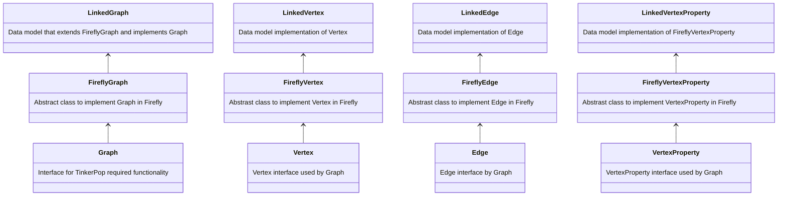
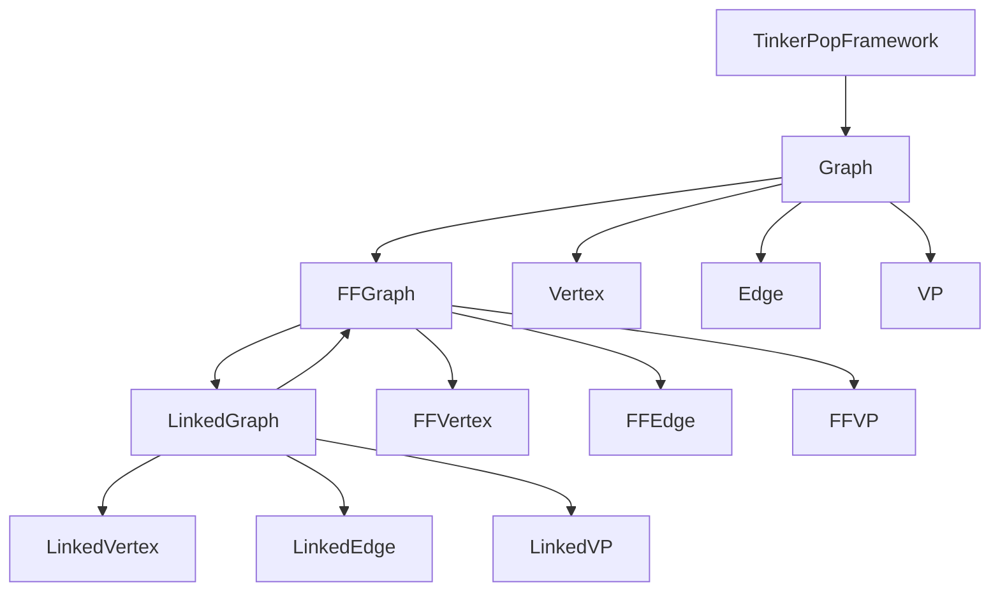

# Data Model Design
**Note - open this in GitHub for images to render**

- The existing abstract classes will likely need tweaking and editing as we make more data models. 
- This is just a first pass on abstraction right now.

The data model is loaded when Firefly starts. A configuration file and a GraphFactory class are used to load the specific Graph implementation.

The specific implementation of the Graph then interfaces with the TinkerPop computing framework to execute traversals.

**Key Takeaways:**
- You must implement an extension of the FireflyVertex, FireflyEdge, FireflyGraph, and FireflyVertexProperty classes for each data model.
- The LinkedGraph uses the Linked*type* classes while the FireflyGraph uses the Firefly*type* classes and the Graph uses the *type* classes.

The idea is to keep the special sauce of each data model in that specific data models graph/objects.

This allows for optimizations for the specific data model to be made there.

**Strategy Considerations:**
- Different data models may use some of the same strategies.
- Some traversal strategies may not make sense for a specific data model.
- Strategies may be specially designed for specific data models.

## Class Diagram
The diagram below gives a rough idea of the hierarchy of the data model.
This diagram ignores the relationship between vertex/edge/vertex property and element
as this just obfuscates the diagram.

## Graph of Objects

The Graph below shows how objects are connected
VertexProperty is abbreviated as VP and Firefly is abbreviated as FF

