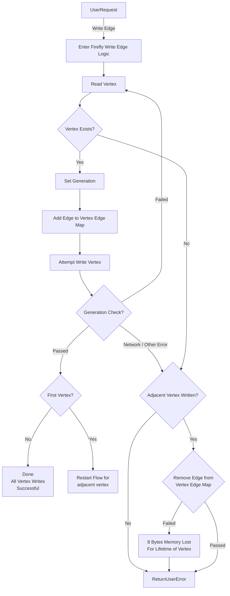

# Design Document For Generation Check Based Write Protection

## Background Information

In the `packed` data model, writing an edge requires performing the following actions:
- Read-modify-write of the adjacent vertices.
- Write of the incident edge.

> Adding vertex properties that overflow into their own records has the
> same class of issue, but for the purpose of this document we will
> focus on edges because they are more complex and the solution can be
> applied to vertex properties.

## Problem Statement

When performing the read-modify-write of adjacent vertices, concurrent writes could cause competing write to 
overwrite the changes made by another read-modify-write flow. This would be considered write corruption.

When performing the write, we could have a situation where some but not all writes fail. Considering that we must
write to two vertices as well as an edge, any combinations of these could pass or fail. This would be considered
a partial write.

A potential implication of a partial write would be a user could see an edge exists from vertex A to vertex B, but 
not from vertex B to vertex A (ignoring directional lingo).

A vertex could be removed while we are adding the edge. This would mean the edge would be orphaned.

## Design Tenets

The presented design must follow these design tenets:
1. Never show an edge in one direction, but not another.
2. Never corrupt data.
3. Alert the user of any write failures, allowing the user to retry writes when the system is operational again.
4. Alert the user that one or more of the adjacent vertices have been dropped if they are removed while the 
edge is being written.

## Design

### Writing

Using a combination of data modelling and generation check policies, we can ensure that the above tenets are met.

The data modelling technique we use is to check that an edge record exists in the edge set, not just in a vertex
when we want to provide the edge to a user. Additionally, we always write the edge to the adjacent vertices before
writing the edge record to the edge set. By doing this, we can ensure that the edge is always visible in both
directions, and never just in one direction. This meets design tenet 1.

Using generation checks, we can ensure that data is never corrupted, which covers design tenet 2. 

The outstanding issues are alerting a user if any write fails, or if an adjacent vertex has been dropped. These
basically both come down to error handling in our writes. The flowchart below describes the write flow to handle this.

Deconstructing the flowchart, we can see that if a vertex doesn't exist (meaning another concurrent thread dropped it), 
we clean up (if required) and return an error to the user. This covers design tenet 4.

We also see that if the generation check fails, we continue to retry the read-modify-write flow. This covers design 
tenet 2.

If we encounter a network error (or any other unexpected errors), we follow the same flow as the vertex exist failure.
In this we attempt to remove the adjacent vertex write if it has been committed, otherwise we return an error to the 
user. This covers design tenet 3.

One this to note, if the network is the issue, we likely cannot remove the partial write. This means that we have lost
8 bytes of memory for the lifetime of the vertex. This is not ideal, but it is tolerable because by our read pattern
of ensure an edge exists before showing a user, we still cover design tenet 1 and ensure that data is consistent in both
traversal directions.

### Removal

#### Edge Removal

We must also consider edge removal. In this case we can simply remove the edge record before removing the edge
from the adjacent vertices. This adheres to design tenet 1, ensuring that the edge is never visible in one
direction but not the other.

Our error handling will be very similar to the above presented flowchart, except if we fail, we do not check if another
vertex was written, we just return the error.

#### Vertex Removal

Finally, vertex removal must be considered. To properly remove a vertex, the edges should be removed first, then the 
vertex itself can be removed. 

If the edges are removed first, then if the vertex removal fails, there are no orphaned edges. There may be valid edges
on the vertex which were removed, but the user is alerted the removal failed and can expect some incident edges of the
vertex have been removed.

The user can retry their vertex removal on error and ensure that it is complete. By removing edges first, we can run into 
the memory leak if removing the edge from an adjacent vertex fails, but this is acceptable because we have already 
removed the edge from the edge set, so we do not have an orphaned edge in the graph. This is a simple 8 byte memory leak
as mentioned in the other case.
