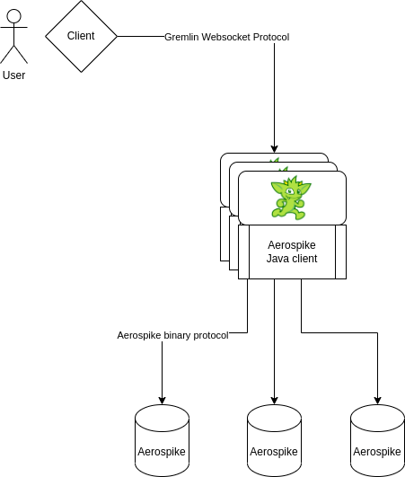

# Setup



> The image above and some identifiers in this document use the project
> codename **`firefly`**. See [`index.md`](index.md) for context — it is
> the same product as *Aerospike Graph Service*.

## What it is

Aerospike Graph Service is a JVM process. Each instance opens one or
more client connections to an Aerospike cluster (per its configuration)
and hosts a TinkerPop `gremlin-server` endpoint over WebSocket. Client
applications connect with a standard Gremlin driver
(`gremlin-python`, `gremlin-javascript`,
TinkerPop's Java `Client`, etc.) and issue normal Gremlin traversals;
the service translates those into efficient Aerospike operations and
streams results back.

## Minimal configuration

Your deployment needs two things:

1. An Aerospike cluster with a namespace provisioned for graph storage.
   The namespace must exist on the cluster *before* the service starts.
2. A properties file the service reads at startup.

### Single-node cluster

```properties
gremlin.graph=com.aerospike.firefly.structure.FireflyGraph
aerospike.client.host=172.17.0.1
aerospike.client.port=3000
aerospike.client.namespace=test
```

### Multi-node cluster

Comma-separate seed addresses:

```properties
gremlin.graph=com.aerospike.firefly.structure.FireflyGraph
aerospike.client.host=172.18.0.3:3000,172.18.0.2:3000,172.18.0.4:3000
aerospike.client.namespace=test
```

## Data model

The service uses a single on-disk graph layout, `packed`, tuned to
keep adjacency information co-resident with the vertex record. It is
the default and the only value `aerospike.graph.data.model` accepts
today. See [`DATA_MODEL_DESIGN.md`](DATA_MODEL_DESIGN.md) for the
layout and [`CONFIG_OPTIONS.md`](CONFIG_OPTIONS.md) for every tunable.

## Advanced: a custom `gremlin-server.yaml`

The service wraps TinkerPop's Gremlin Server, so advanced users can
supply a full `gremlin-server.yaml`. The container wires the properties
file to Gremlin Server automatically; if you need to override the
server config, drop a custom YAML at
`/opt/aerospike-graph/custom/aerospike-graph-service.yaml`.

See [`DOCKER_USER_DOCUMENTATION.md`](DOCKER_USER_DOCUMENTATION.md) for
the Docker-specific version of this.
