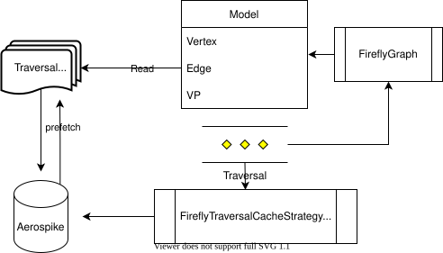

# Firefly Traversal Cache

FireflyTraversalCacheStrategy adds a traversal specific Guava cache to supported traversals.

If 
ConcurrentHashMap<UUID, TraversalCache> traversalCacheSet is a Map from an assigned TraversalID to a Cache specific to that traversal.

A Step is appended to the end of the traversal that will remove the cache at completion of the traversal.

For supported traversals, the FireflyTraversalCacheStrategy will pack a unique id in a step prepended to the traversal 
and create a cache specific to that traversal identified by this id.

The Traversal is exposed to the AerospikeConnection storage layer via a ThreadLocal

Aerospike reads and writes are proxied through the cache by looking at the Traversal in the storage layer   

For enabled PrefetchTasks, they will be triggered (either upfront or in the background by configuration) at the beginning of the traversal.

Given a Function from (Traversal) -> (Aproximate Aerospike Record Set), a PrefetchTask can tell be backend "start sending all the records your think this traversal will need into the cache"

If it has an accurate PrefetchTask, the longer a Traversal executes,  it should get closer to running entirely in-memory.
