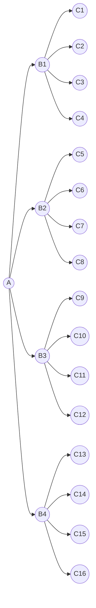
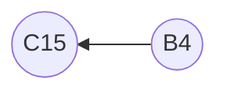

# Bidirectional Search Part I

This is part one of a two part series on bidirectional search. 

This first part will explore:
- Deriving expressions for search time when applying bidirectional search
- Queries that can be used to implement bidirectional search in Gremlin
- Comparing search time of bidirectional search to unidirectional search

The second part will explore:
- How to implement bidirectional search in a TinkerPop strategy
- Comparing a strategy to a query for bidirectional search

# Overview

Bidirectional search is a graph search algorithm. Bidirectional search can be used to find the path
between two constrained areas of the graph. It runs two simultaneous searches; one forward from the initial state,
and one backward from the goal, stopping when the two meet in the middle.

# Search Time

The search time of searching a graph for the path between two constrained areas of the graph can be approximated
as the search area that is being searched.

Consider a graph with a branching factor, `b`, where the search is run from a constrained area, `A` to another
constrained area, `B`, where the shortest path between `A` and `B` has a depth, `d`.

Note: 
- `A->X->Y->Z->B` is a path from `A` to `B` with a depth of 4.
- `A->X->Y->Z` is a path from `A` to `Z` with a depth of 3.

## General Expression for Search Area

The search area is the number of vertices in the graph that are touched and each step of the search moves 
to `b` new vertices per vertex that is currently being traversed from. 

With a total of `d` steps, the general expression for the search area where moving from `A->B` is `b^d`.

## Bidirection Expression for Search Area

Bidirectional search runs two simultaneous searches, one moving from `A->B` and another from `B->A`. These searches 
will intersect at some point, `C`, where the shortest path between `A` and `B` is found. 

If the depth `d` of the search is even, then the intersection area `C` will be at an area that is `d/2` steps 
from both `A` and `B`.

If the depth `d` of the search is odd, then the intersection area `C` will be either at an area that is `d/2` 
steps from `A` and `d/2 + 1` steps from `B`, or `d/2 + 1` steps from `A` and `d/2` steps from `B`.

The general expressions for the search area where moving from `A->C` and `B<-C` with bidirectional search
is `b^(d/2) + b^(d/2)` for even `d` and `b^(d/2) + b^(d/2 + 1)` for odd `d`.

These can be simplified to:
- `2*b^(d/2)` for even `d`
- `(1+b)*b^(d/2)` for odd `d`

## Expressions with Starting Areas Considered

If we consider the starting area sizes, the expressions can be modified as follows:
- `A*b^(d/2) + B*b^(d/2)` for even `d`
- `A*b^(d/2) + B*b^(d/2+1)` OR `A*b^(d/2+1) + B*b^(d/2)` for odd `d`
- `A*b^(d)` OR `B*b^(d)` for unidirectional search

# The Gambit/Pitfall/Footgun/Trap of Bidirectional Search

Bidirectional search can be a powerful tool for finding the shortest path(s) between two areas in a graph. However,
it can make the search time much longer depending on the constraints of the search. For example, if the area `B`
is very poorly constrained and contains a large number of vertices, then the search time can be much longer than
a unidirectional search from `B` to `A`.

## Visualization of Bidirectional Search

Visualizing this makes the search area more clear. Consider a graph with a branching factor of 4, where the vertices are
a depth of 2 apart.

A unidirectional search from A->B->C will look like this:


Consider C10 as the destination of the unidirectional search above. In this case the query touches A, B1-4, and C1-16,
a total of 21 vertices to move from A->C10.

Now consider a bidirectional search from A->C10. The search will start at A and move to B1-4, then from C10 back to B4
at this point an intersection is found and the search is done. 

The search area from A->B1-4 will look like this:
```mermaid
graph LR
A((A)) --> B1((B1))
A((A)) --> B2((B2))
A((A)) --> B3((B3))
A((A)) --> B4((B4))
C15((C15)) <-- B4((B4))
```

The search area from C10->B4 will look like this:


This search touches A, B1-4, and C15, a total of 6 vertices to find the path from A->C10.

This is a reduction of ~71% of the search area.

## Example

Consider a graph of all the people on a planet that is similar to earth, except on this planet every person knows
exactly 10 people. The graph is a directed graph where each person is a vertex and each person knows 10 other
people, so there are 10 edges from each vertex and to each vertex.

### Well Constrained Starting Area

Consider a well constrained search of this graph where the search starts on a person with name "Foobar" and looks for
a connection a person named "Foobaz", where there is only 1 "Foobar" and 1 "Foobaz" on this planet. The search will
start at "Foobar" and move to 10 people, then to 100 people, then to 1,000 people, and so on until it finds
a person named "Foobaz". The search time will be `b^d` where `b` is 10 and `d` is the depth of the search. 

If we assume "Foobar" and "Foobaz" are a depth of 7 apart, then applying the general expression for search area of an odd
depth, the search area will be:

```
A==1, B==1, b==10, and d==7

A*b^(d/2) + B*b^(d/2+1) or A*b^(d/2+1) + B*b^(d/2) 
1*10^3    + 1*10^4      or 1*10^4      + 1*10^3
```
which are equal and solve to 1,100

### Poorly Constrained Starting Area

Consider a well constrained search of this graph where the search starts on a person with name "Barfoo" and looks for
a connection a person named "Bazfoo", where there is only 1,000 "Barfoo"'s and 1 "Bazfoo"'s on this planet.

If we assume "Bazfoo" and "Barfoo" are a depth of 7 apart, then applying the general expression for search area of an odd
depth, the search area will be:

```
A==1,000, B==1, b==10, and d==7

A*b^(d/2)  + B*b^(d/2+1) or A*b^(d/2+1) + B*b^(d/2) 
1,000*10^3 + 1*10^4      or 1,000*10^4  + 1*10^3
```
which are not equal, in one case it is 1,010,000 and in the other it is 10,001,000.

### Unidirection Search

For unidirectional search, we'd get:
```
A==1,000, B==1, b==10, and d==7

A*b^(d)    or B*b^(d) 
1,000*10^7 or 1*10^7
```

which are not equal, in one case it is 10,000,000,000 and in the other it is 10,000,000, and do not have a similar magnitude.

### Comparison of Results

|                    | Unidirectional | Bidirectional           |
|--------------------|----------------|-------------------------|
| Poorly Constrained | 10,000,000,000 | 1,010,000 or 10,001,000 |   
| Well Constrained   | 10,000,000     | 1100                    |

In this example we can extrapolate that bidirectional search reduces the search area significantly, however
a poorly constrained bidirectional search may or may not be better than a well constrained unidirectional search.

## Bidirectional Search in Gremlin

Gremlin can be used to perform bidirectional search. The following query is an example of bidirectional serach
in Gremlin. The query starts on constraint A and constraint B, then toggles between moving out from A and
in from B until the two meet in the middle. The query then returns the path and the value of the intersection.

g.
    V().<constraint 2>.as("A").
    V().<constraint 2>.as("B").
    repeat(
        __.choose(__.loops().math("_ % 2").is(P.eq(0)),
            __.select("A").out().simplePath().as("A"),
            __.select("B").in().simplePath().as("B"))).
    until(__.
        select("A").id().as("a-id").
        select("B").id().as("b-id").
        select("a-id", "b-id").
        where("a-id", P.eq("b-id")).
        count().is(P.gt(0))
    ).
    project("path", "intersection-value").
    by(__.path().by(<value>)).
    by(__.select("A").values(<value>)).
    toList()

Because this is not a native operation in gremlin and instead is done as a workaround, the query has some quirks.
For example, the path returned is a little oddly ordered, which will be explained in the example below.


## Bidirectional Search Example in Gremlin

The following complete example uses the 
[air-routes dataset](https://github.com/krlawrence/graph/blob/master/sample-data/air-routes-latest.graphml)
provided and maintained by Kelvin Lawrence. The example shows how to find the shortest paths from "YQQ" 
(Comox Valley Airport) to "NAP" (Naples Airport). 

```java
final List<Map<String, Object>> intersection = g.
        V().has("code", "YQQ").as("A").
        V().has("code", "NAP").as("B").
        repeat(
                __.choose( 
                        __.loops().math("_ % 2").is(P.eq(0)),
                        __.select("A").out("route").dedup().as("A"),
                        __.select("B").in("route").dedup().as("B"))
        ).
        until(
                    __.
                            select("A").id().as("a-id").
                            select("B").id().as("b-id").
                            select("a-id", "b-id").
                            where("a-id", P.eq("b-id")).
                            count().is(P.gt(0))
        ).
        project("path", "intersection-code").
        by(__.path().by("code")).
        by(__.select("A").values("code")).
        toList();

for (final Map<String, Object> map : intersection){
        final Path path = (Path)map.get("path");
        final String start = path.get(0);
        final String end = path.get(1);
        final List<String> middleLeft = new ArrayList<>();
        final List<String> middleRight = new ArrayList<>();

        // Due to the way the traversal is written, the path goes A0, B0, A0, A1, B0, B1, A1, A2, ...
        for(int i = 3; i < path.size(); i+=4){
            middleLeft.add(path.get(i));
        }

        // Due to the way the traversal is written, the path goes A0,  B0,   A0,  A1,  B0,  B1,  A1,  A2,  B1, B2
        //                                                        YQQ, NAP, YQQ, YVR, NAP, EWR, YVR, AUS, EWR, AUS
        for(int i = 5; i< path.size(); i += 4){
            middleRight.add(path.get(i));
        }

        final List<String> completePath = new ArrayList<>();
        assert!middleRight.isEmpty();
        assert!middleLeft.isEmpty();
        Collections.reverse(middleRight);

        if (middleLeft.get(middleLeft.size() - 1).equals(middleRight.get(0))) {
        System.out.println("Intersection - " + middleLeft.get(middleLeft.size() - 1));
        // Don't want to duplicate the intersection
        middleRight.remove(0);
        }

        // Middle right is in reverse order
        completePath.add(start);
        completePath.addAll(middleLeft);
        completePath.addAll(middleRight);
        completePath.add(end);
        System.out.println(completePath);
    }
```

It is obvious from the output that the path is not ordered as expected. The path returned needs to be deconstructed 
and reconstructed, however this does show a full example of how to perform bidirectional search in a single query in 
Gremlin.

In the second part of this two part series, we will explore how to implement bidirectional search in TinkerPop
and compare query complexity, performance, and ease of use between the non-native query and a custom implementation.
